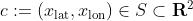
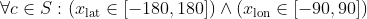

# A pure numpy implementation of citipy


<div align="center">
    <h2 style="font-color: pink">Find cities with <b>math</b>, not packages!</h2>
</div>

The code necessary for completing the singular task the original package accomplishes
is quite succinct, so I removed the unnecessary dependancy `kdtree`.

We wish to find the nearest city to a given a latitude-longitude pair,
which we can define formally as

##### Note: I'll fix the TeX bits soon.



Where S is the subset of real number pairs defined by



Now, contained in this package is a CSV of world cities and their coordinates.

We seek to find the city in our list of cities that minimizes the euclidean distance
between $_{\text{nearest}} and our defined coordinate pair, which we call c_i

I've grown tired of writing LaTeX. But you get the idea.

You can load csv data with numpy using the `np.genfromtxt` function.
The python code is as follows:

```python

lats = # numpy array of latitudes
lons = # numpy array of longitudes
names = # List of city names

def nearest_city(lat, lon, field="city"):
    
    # Calculate euclidean distances in a fast, vectorized way
    distances = np.sqrt((lats - lat) ** 2 + (lons - lon) ** 2)

    # Find the index of the minimum value
    index = distances.argmin()

    # Return the name at that index
    return names[index]
```

Now, while I promised a **pure numpy** implementation, my code uses pandas.

That can easily be fixed with the `np.genfromtxt` function, but that exercise is left to the reader.
